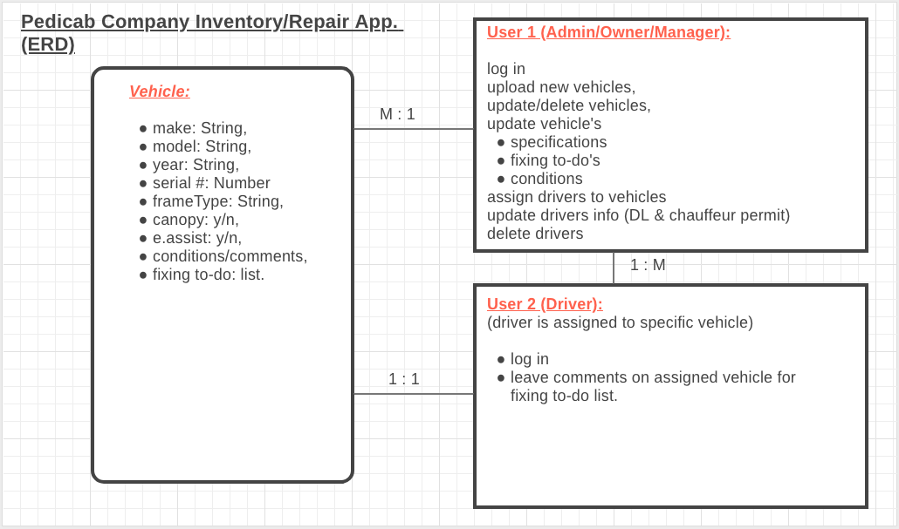
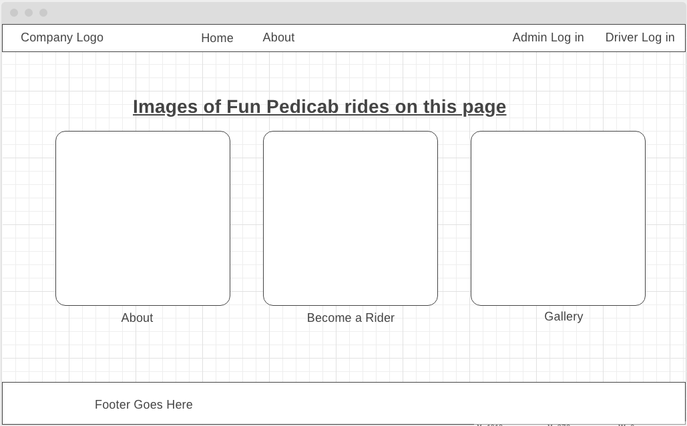
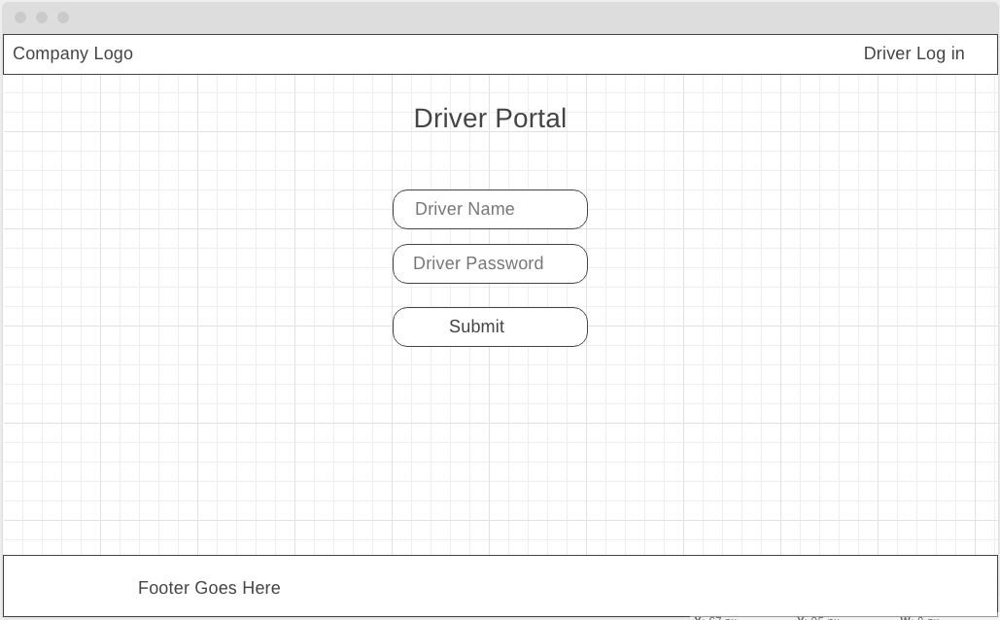
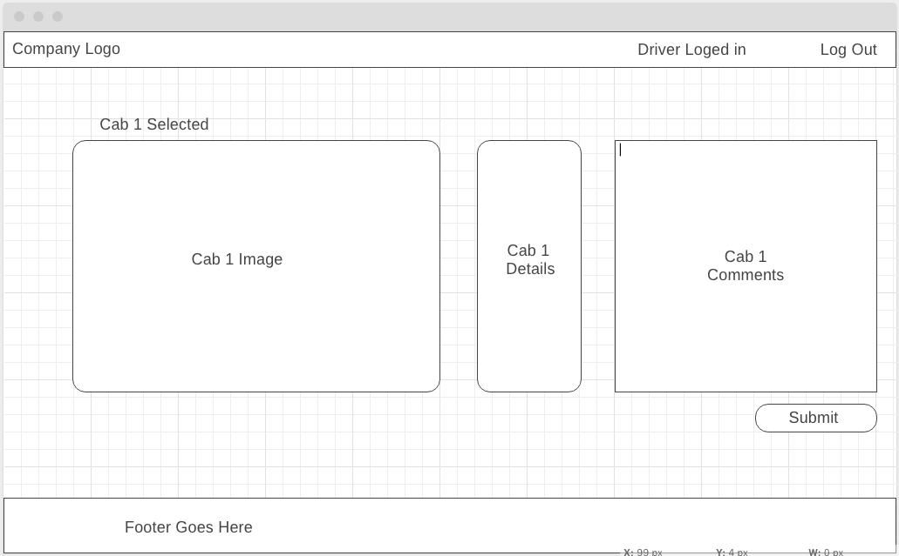
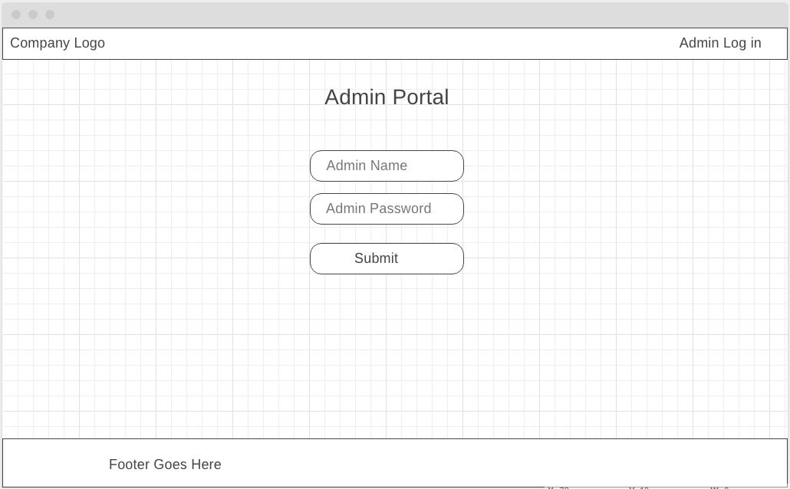
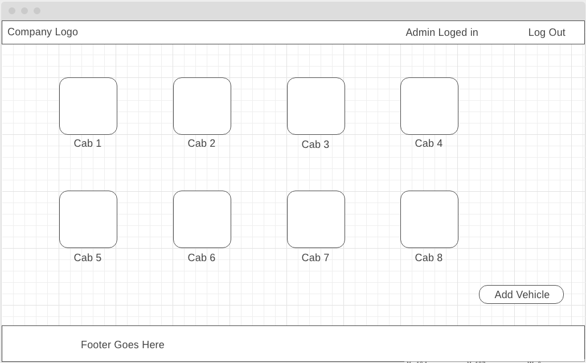
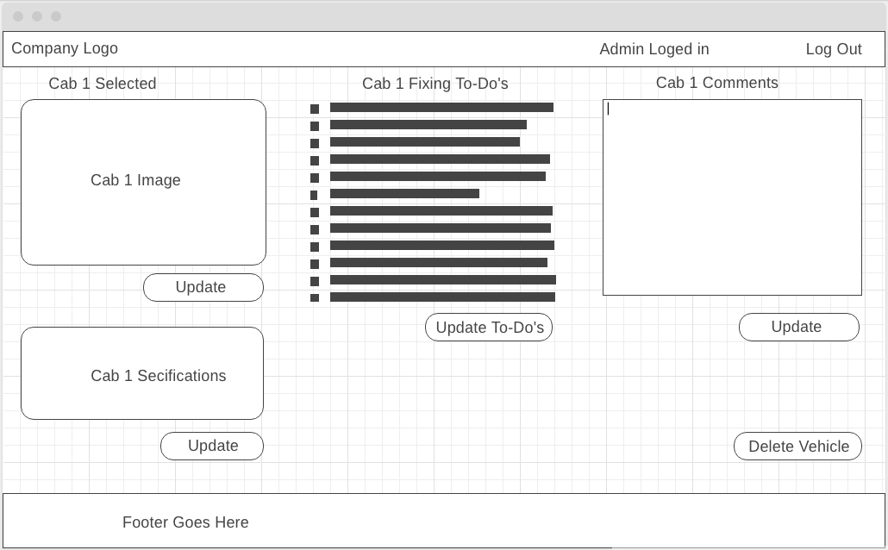
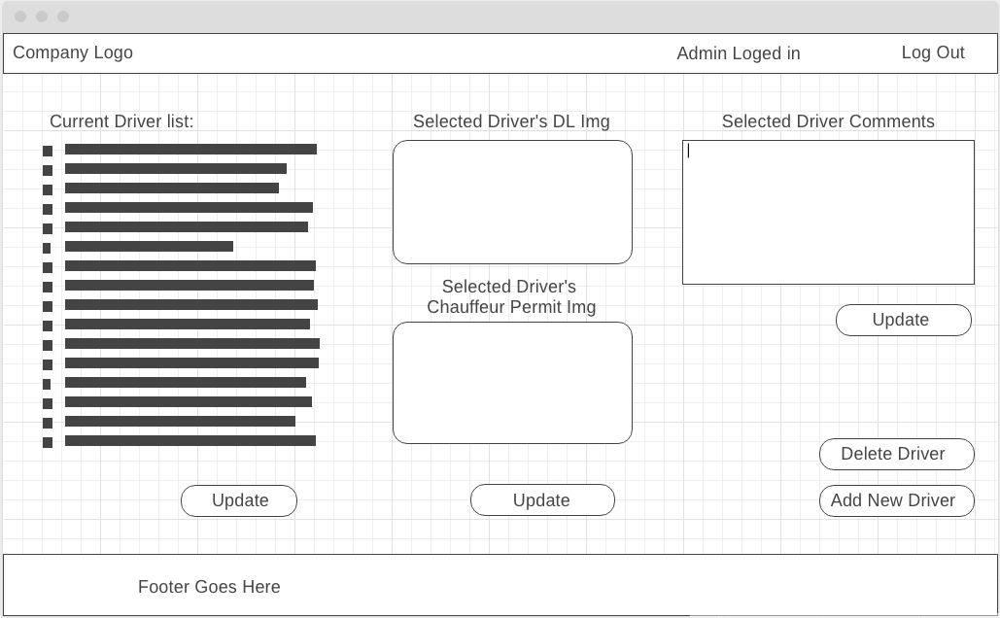

# GA-WDI-Project2

## Inventory App

### 1. Trello Board
[Trello Board link](https://trello.com/b/G2RHDvIP "Trello Board Project 2")

### 2. ERD

### 3. Index Page

### 4. Driver LogIn Portal (drivers/logIn)

### 5. Driver Vehicle Coment (drivers/show)

### 6. Admin LogIn Portal (cabs/logIn)

### 7. Admin Vehicle List (cabs/index)

### 8. Admin Vehicle Details (cabs/show)

### 9. Admin Drivers List (drivers/show)

